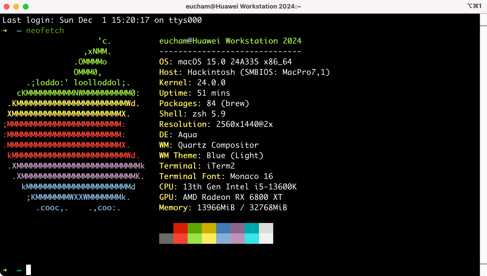

I got a strange problem that the macOS's booting procedure was quited after selecting macOS from OpenCore and then reboot. After removing the OnBoard M.2 WiFi & Bluetooth(Because no options found to disable OnBoard M.2 WiFi & Bluetooth), it boots normally.

## Hardwares

| Item                            | Detail                                   |
| :------------------------------ | ---------------------------------------- |
| Motherboard                     | Gigabyte Z790 Aorus Elite AX DDR5 Ver1.0 |
| CPU                             | i5-13600K                                |
| GPU                             | AMD Radeon RX6800 XT                     |
| WiFi & Blutooth（PCIE）         | Fenvi T919                               |
| WiFi & Blutooth（M.2 On board） | ***<u>REMOVED PHYSICALLY</u>***          |
| Memory                          | Kinston DDR5 5200MHz 16GB x 2            |
| Storages                        | M.2 SSD x 4                              |
| BIOS Version                    | F7                                       |

## Current Version

- OpenCore 1.0.2
- macOS Sequoia 15.0

## Works fine

- Start and shutdown
- App Store login and download
- iCloud,iMessage,AirDrop
- WiFi, Bluetooth, Ethernet

## Known Issues

- Can't sleep in both Windows 11 and macOS after booting from OpenCore. If boot from Windows 11's bootloader directly, sleeps as expected. This config may need to be fixed later.

## BIOS Settings

- **Secure Boot : Disabled**
- **Internal Graphics : Disabled**
- Above 4G Decoding : Enabled
- Above 4GB MMIO BIOS assignment : Enabled
- Re-Size BAR Support : Disabled
- **Intel Platform Trust Technology(PTT): Disabled**
- **Hyper-Threading : Enabled**
- **CFG Lock : Disabled**

---

- Fast Boot - Disabled
- CSM - Disabled
- VT-d, Thunderbolt - Disabled
- Serial port - Disabled
- Intel SGX - Disabled

---

- OS type: Other OS
- EHCI/XHCI Hand-off - Enabled
- Security Device Support - Disable
- Internal Graphics - Disabled

## What to do next?

- Generate model information after selecting `iMac 7,1`.
- Hope your hackintosh come to you as soon as possibile and have a good night!

## Other things may help

- Reset NVRAM after changing EFI

## Key shots about this motherboard

| Key Shot | Functionality                      |
| -------- | :--------------------------------- |
| Del      | Get into BIOS Setup                |
| F12      | Select bootloader to start         |
| F10      | Save & Quit                        |
| F2       | Change to Advanced Mode in BIOS UI |

## References

- [Gigabyte BIOS Driver Support](https://www.aorus.com/motherboards/Z790-AORUS-ELITE-AX-rev-10/Support)

- [Gigabyte Motherboard manuual (Simplified Chinese)](https://download.gigabyte.com/FileList/Manual/mb_manual_intel700-features_sc.pdf)

- [xtvj/Gigabyte-Z790-Aorus-Elite-AX-13700K-OpenCore](https://github.com/xtvj/Gigabyte-Z790-Aorus-Elite-AX-13700K-OpenCore-Hackintosh)

- [Xmingbai/Gigabyte-Z790-Aorus-Elite-13900KF](https://github.com/Xmingbai/Gigabyte-Z790-Aorus-Elite-13900KF-hackintosh)

- [Gigabyte hackintosh BIOS settings](https://www.bilibili.com/read/cv8519606)

- [Common-problems-and-solutions-in-macOS-Ventura-13.0](https://blog.daliansky.net/Common-problems-and-solutions-in-macOS-Ventura-13.0-installation.html)

- [Install macOS on any PC | OpenCore Guide](https://www.youtube.com/watch?v=eUnVzJsINCI)

- [Getting started with OpenCore](https://dortania.github.io/OpenCore-Install-Guide/prerequisites.html)

- [OpenCore GitHub (Base Project)](https://github.com/acidanthera/OpenCorePkg/releases)

---

- [Opencore Mac](https://christitus.com/opencore-mac/)

- [All Drivers, Kexts, and SSDTs](https://dortania.github.io/OpenCore-Desktop-Guide/ktext.html)

- [GitMacOS GitHub (Download Official Apple PKGs)](https://github.com/corpnewt/gibMacOS)

- [ProperTree (config.plist editing)](https://github.com/corpnewt/ProperTree)

- [SSDTTime (DSDT Dump and SSDT creation)](https://github.com/corpnewt/SSDTTime)

- [GenSMBIOS (Generate Serial and UUID)](https://github.com/corpnewt/GenSMBIOS)

## Wifi & Bluetooth on macOS Sequoia

### Steps

1. `AMFI` block

Add kext: [AMFIPass.kext](https://github.com/bluppus20/AMFIPass/releases)

**No need to** add boot-args `NVRAM>Add>UUID>boot-args|-amfipassbeta` for `AMFIPass.kext` while its version isabove v1.4.0. (UUID:7C436110-AB2A-4BBB-A880-FE41995C9F82)

2. `csi-active-config`

Set value `NVRAM>Add>UUID>csr-active-config | 03080000`(UUID:7C436110-AB2A-4BBB-A880-FE41995C9F82). And remember to **reset NVRAM** while starting macOS.

3. Disable `SecureBootModel` if needed

`Misc>Security>SecureBootModel`: `Disabled` 

4. Block `com.apple.iokit.IOSkywalkFamily` kext

`Kernel>Block>`: with identifier `com.apple.iokit.IOSkywalkFamily` and Strategy `Exclude`.

5. Add [kexts](https://github.com/dortania/OpenCore-Legacy-Patcher/tree/main/payloads/Kexts/Wifi) in order as follows

   - IOSkywalkFamily.kext
   - IO80211FamilyLegacy.kext
   - IO80211FamilyLegacy.kext>AirPortBrcmNIC.kext

   it's better to set MinKernel to 23.0.0.

6. Add boot-args to fix web-based applications crashes  such as Postman, Dingtalk.

   - `revpatch=sbvmm`（RestrictEvents.kext need）

   - `ipc_control_port_options=0`

   reboot

6. Download and Install [OpenCore Legacy Patcher（OCLP）](https://github.com/dortania/OpenCore-Legacy-Patcher/releases), and then do as follows:

   OCLP.app>Post-Install Root Patch>Start Root Patching>Reboot

### Reference

- https://www.cnblogs.com/wkvip/p/17787077.html
- https://bbs.pcbeta.com/viewthread-1992658-1-1.html
- https://heipg.cn/tutorial/patch-brcm-wireless-card-macos-sonoma.html

